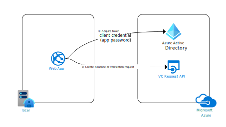

# Azure AD Verifiable Credentials Samples

This repo contains a set of Azure AD Verifiable Credentials samples

## Samples
| Sample | Description |
|------|--------|
| ASP.NET Core | .NET sample for using the VC Request API to issue and verify verifiable credentials with a credential contract which allows the VC Request API to pass in a payload for the Verifiable Credentials|

Microsoft provides a simple to use REST API to issue and verify verifiable credentials. You can use the programming language you prefer to the REST API. Instead of needing to understand the different protocols and encryption algoritms for Verifiable Credentials and DIDs you only need to understand how to format a JSON structure as parameter for the VC Request API.




## Running locally

### Prerequisites
- .NET Core IDE (VS, VS Code, Rider etc)
- .NET 6.0. Download [here](https://dotnet.microsoft.com/en-us/download/dotnet/6.0)
- Azure Subscription. Get on FREE [here](https://azure.microsoft.com/free/)
- Ngrok. Download [here](https://ngrok.com/download)

### Sample configuration
Once you go through the process of setting up your Verifiable Credentials environment, you can run the sample locally. You will need to update the `appsettings.json` file with your Azure AD Verifiable Credentials configuration.

```JSON
 "AppSettings": {
    "CredentialTypes": "BlogReader,StreamViewer,YouTubeWatcher,HackathonParticipant,TikTokWatcher,InstagramFollower,TwitterSpaceParticipant",
    "IssuerCallbackUrl": "<ngrok public endpoint>/api/issuer/issuanceCallback",
    "PresentationCallbackUrl": "<ngrkok public endpoint>/api/verifier/presentationCallback",
    "Endpoint": "https://beta.did.msidentity.com/v1.0/{0}/verifiablecredentials/request",
    "VCServiceScope": "bbb94529-53a3-4be5-a069-7eaf2712b826/.default",
    "Instance": "https://login.microsoftonline.com/{0}",
    "TenantId": "<your Azure AD Tenant ID e.g 3c32ed40-8a10-465b-8ba4-0b1e86882668>",
    "ClientName": "<Any name will do e.g verifiable-credential-demo>",
    "ClientId": "<the client Id of your Service principal, e.g 992250d6-8118-4823-8f2c-b3196f45e309>",
    "UseKeyVaultForSecrets": true,
    "KeyVaultName": "<your key vault name: i.e mysafekeyvalt>",
    "ClientSecret": "<Populate only if you're not using KeyVault>",
    "CertificateName": "<Populate only if you're using a certificate to auth to Azure AD",
    "IssuerAuthority": "did:ion:EiD_rKiP...fX0",
    "VerifierAuthority": "did:ion:EiD_...lEifX0",
    "CredentialManifest": "https://beta.did.msidentity.com/v1.0/b841331d-abdf-482b-b18c-8c70b99faf8e/verifiableCredential/contracts/"
  }
```
Configuration details:
To authenticate to Azure AD, you can use either a certificate or a client secret. The recommended approach is to use a certificate. However, testing with a client secret is usually easier (but less secure). 

If you are using a certificate, you will need to provide the following information:
- `CertificateName:` The name of the certificate

If you're using a Client Secret, and want to hardcoded in the config (not recommended) you will need to provide the following information:
- `ClientSecret`: The client secret value

Alternatively, you can use a KeyVault to store the client secret. In this case, you will need to provide the following information:
- `UseKeyVaultForSecrets`: true (this is a boolean value)
- `KeyVaultName`: The name of the KeyVault
In Azure Key Vault, you will need to create a secret with the name `ClientSecret` and the value of your client secret. You also need to sign in locally to the Azure CLI with an account that has Secret read access to Key Vault secrets. You can use either [RBAC](https://docs.microsoft.com/en-us/azure/key-vault/general/rbac-guide?tabs=azure-cli) or an [Access Policy](https://docs.microsoft.com/en-us/azure/key-vault/general/assign-access-policy?tabs=azure-portal) to grant access to your account to the Key Vault.

### Using Ngrok
The use of Ngrok is necessary as the VC Request API requires a publicly accessible endpoint. You can use Ngrok to create a public endpoint for your VC Request API using the following command:

```bash
ngrok http https://localhost:5001
```
If you wish to use an TLS secured endpoint (https) - this requires a paid version of ngrok - you can use the following command:

```bash
ngrok https https://localhost:5001
```
Once Ngrok has created a public endpoint, you can update the `appsettings.json` file with the public endpoint. E.g.

```JSON
"IssuerCallbackUrl": "<your ngrok public endpoint>/api/issuer/issuanceCallback",
"PresentationCallbackUrl": "<your ngrkok public endpoint>/api/verifier/presentationCallback",
```

### Running the sample
In your terminal, navigate to the `src` directory and run the following command:

```bash
dotnet run
```

This should start the sample. The local URI for the sample is `https://localhost:5000`.

### Potential issues
- If your Issue and Verification pages don't work, make sure that Key Vault has been configured correctly and that the account signed in to Azure CLI has the correct permissions to access the Key Vault.
- If your Issue and Verifications pages fail to return any results, double check the configuration in the `appsettings.json` file.
- If you're using a certificate, make sure that the certificate is valid and that the certificate has been added to the Azure AD tenant.
- If you're using a cerficate, ensure that the certificate is installed in the local certificate store
- If you're using a client secret, make sure that the client secret is valid (check for typos, spaces or missing characters) and that the client secret has not expired.
- Check both the .NET logs and the browser console for any errors.

## Issuance

### Issuance JSON structure

To call the VC Client API to start the issuance process, the VC Request API needs a JSON structure payload like below. 

```JSON
{
  "authority": "did:ion: ...of the Issuer",
  "includeQRCode": true,
  "registration": {
    "clientName": "the verifier's client name"
  },
  "callback": {
    "url": "https://contoso.com/api/issuer/issuanceCallback",
    "state": "you pass your state here to correlate it when you get the callback",
    "headers": {
        "keyname": "any value you want in your callback"
    }
  },
  "issuance": {
    "type": "your credentialType",
    "manifest": "https://beta.did.msidentity.com/v1.0/3c32ed40-8a10-465b-8ba4-0b1e86882668/verifiableCredential/contracts/VerifiedCredentialExpert",
    "pin": {
      "value": "012345",
      "length": 6
    },
    "claims": {
      "given_name": "Megan",
      "family_name": "Bowen"
    }
  }
}
```

- **authority** - is the DID identifier for your registered Verifiable Credential from portal.azure.com.
- **includeQRCode** - If you want the VC Client API to return a `data:image/png;base64` string of the QR code to present in the browser. If you select `false`, you must create the QR code yourself (which is not difficult).
- **registration.clientName** - name of your app which will be shown in the Microsoft Authenticator
- **callback.url** - a callback endpoint in your application. The VC Request API will call this endpoint when the issuance is completed.
- **callback.state** - A state value you provide so you can correlate this request when you get callback confirmation
- **callback.headers** - Any HTTP Header values that you would like the VC Request API to pass back in the callbacks. Here you could set your own API key, for instance
- **issuance.type** - the name of your credentialType. This value is configured in the rules file.
- **issuance.manifest** - url of your manifest for your VC. This comes from your defined Verifiable Credential in portal.azure.com
- **issuance.pin** - If you want to require a pin code in the Microsoft Authenticator for this issuance request. This can be useful if it is a self issuing situation where there is no possibility of asking the user to prove their identity via a login. If you don't want to use the pin functionality, you should not have the pin section in the JSON structure. The appsettings.PinCode.json contains a settings for issuing with pin code.
- **issuance.claims** - optional, extra claims you want to include in the VC.

In the response message from the VC Request API, it will include a URL to the request which is hosted at the Microsoft VC request service, which means that once the Microsoft Authenticator has scanned the QR code, it will contact the VC Request service directly and not your application directly. Your application will get a callback from the VC Request service via the callback.

```json
{
    "requestId": "799f23ea-524a-45af-99ad-cf8e5018814e",
    "url": "openid://vc?request_uri=https://beta.did.msidentity.com/v1.0/abc/verifiablecredentials/request/178319f7-20be-4945-80fb-7d52d47ae82e",
    "expiry": 1622227690,
    "qrCode": "data:image/png;base64,iVBORw0KGgoA<SNIP>"
}
```

### Issuance Callback

In your callback endpoint, you will get a callback with the below message when the QR code is scanned. This callback is typically used to modify the UI, hide the QR code to prevent scanning again and show the pincode to use when the user wants to accept the Verifiable Credential.

```JSON
{
  "code":"request_retrieved",
  "requestId":"9463da82-e397-45b6-a7a2-2c4223b9fdd0",
  "state": "...what you passed as the state value..."
}
```

Once the VC is issued, you get a second callback which contains information if the issuance of the verifiable credential to the user was succesful or not.

This callback is typically used to notify the user on the issuance website the process is completed and continue with whatever the website needs or wants the user to do.

### Successful Issuance flow response
```JSON
{
  "code":"issuance_successful",
  "requestId":"9463da82-e397-45b6-a7a2-2c4223b9fdd0",
  "state": "...what you passed as the state value..."
}
```
### Unuccesful Issuance flow response
```JSON
{
  "code":"issuance_failed",
  "requestId":"9463da82-e397-45b6-a7a2-2c4223b9fdd0", 
  "state": "...what you passed as the state value...",
  "error": {
      "code":"IssuanceFlowFailed",
      "message":"issuance_service_error",
    }
}
```
When the issuance fails this can be caused by several reasons. The following details are currently provided in the error part of the response:
| Message | Definition |
|---|---|
| fetch_contract_error | The user has canceled the flow |
| issuance_service_error | VC Issuance service was not able to validate requirements / something went wrong on Microsoft AAD VC Issuance service side. |
| unspecified_error | Something went wrong that doesn’t fall into this bucket |


## Verification

### Verification JSON structure

To call the VC Request API to start the verification process, the application creates a JSON structure like below. Since the WebApp asks the user to present a VC, the request is also called `presentation request`.

```JSON
{
  "authority": "did:ion: did-of-the-Verifier",
  "includeQRCode": true,
  "registration": {
    "clientName": "the verifier's client name",
    "purpose": "the purpose why the verifier asks for a VC"
  },
  "callback": {
    "url": "https://contoso.com/api/verifier/presentationCallback",
    "state": "you pass your state here to correlate it when you get the callback",
    "headers": {
        "keyname": "any value you want in your callback"
    }
  },
  "presentation": {
    "includeReceipt": false,
    "requestedCredentials": [
      {
        "type": "your credentialType",
        "purpose": "the purpose why the verifier asks for a VC",
        "acceptedIssuers": [ "did:ion: ...of the Issuer" ]
      }
    ]
  }
}
```

Much of the data is the same in this JSON structure, but some differences needs explaining.

- **authority** vs **acceptedIssuers** - The Verifier and the Issuer may be two different entities. For example, the Verifier might be a online service, like a car rental service, while the DID it is asking for is the issuing entity for drivers licenses. Note that `acceptedIssuers` is a collection of DIDs, which means you can ask for multiple VCs from the user coming from different trusted issuers.
- **presentation** - required for a Verification request. Note that `issuance` and `presentation` are mutually exclusive. You can't send both.
- **requestedCredentials** - please also note that the `requestedCredentials` is a collection too, which means you can ask to create a presentation request that contains multiple DIDs.
- **includeReceipt** - if set to true, the `presentation_verified` callback will contain the `receipt` element.

### Verification Callback

In your callback endpoint, you will get a callback with the below message when the QR code is scanned.

When the QR code is scanned, you get a short callback like this.
```JSON
{
  "code":"request_retrieved",
  "requestId":"c18d8035-3fc8-4c27-a5db-9801e6232569", 
  "state": "...what you passed as the state value..."
}
```

Once the VC is verified, you get a second, more complete, callback which contains all the details on what whas presented by the user.

```JSON
{
    "code":"presentation_verified",
    "requestId":"c18d8035-3fc8-4c27-a5db-9801e6232569",
    "state": "...what you passed as the state value...",
    "subject": "did:ion: ... of the VC holder...",
    "issuers": [
      {
        "authority": "did:ion of the issuer of this verifiable credential ",
        "type": [ "VerifiableCredential", "your credentialType" ],
        "claims": {
            "lastName":"Bowen",
            "firstName":"Megan" 
        },
        "domain":"https://did.woodgrovedemo.com",
        "verified": "DNS"
      }
    ],
    "receipt":{
        "id_token": "...JWT Token of VC..."
        }
    }
}
```
Some notable attributes in the message:
- **claims** - parsed claims from the VC
- **receipt.id_token** - the ID token of the presentation, this is the full presentation Authenticator has send to the Request service. Great for debugging and also to retrieve information not available in the payload. To keep the responses small the receipt property in the request should be set to false.


## Setup

Before you can run any of these samples make sure your environment is setup correctly. You can follow the setup instructions here [here](https://aka.ms/didfordevs)


## Resources

For more information, see MSAL.NET's conceptual documentation:

- [Quickstart: Register an application with the Microsoft identity platform](https://docs.microsoft.com/azure/active-directory/develop/quickstart-register-app)
- [Quickstart: Configure a client application to access web APIs](https://docs.microsoft.com/azure/active-directory/develop/quickstart-configure-app-access-web-apis)
- [Acquiring a token for an application with client credential flows](https://aka.ms/msal-net-client-credentials)
