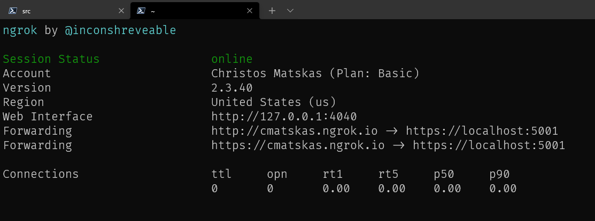
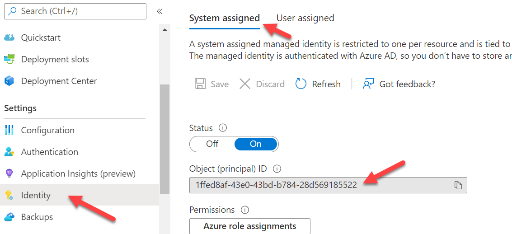
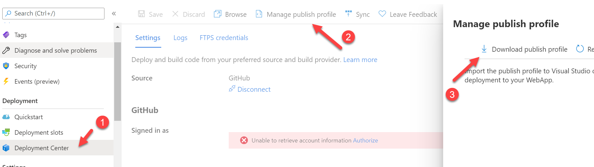

# Verifiable Credentials Code Sample

This code sample demonstrates how to use Microsoft's Azure Active Directory Verifiable Credentials preview to issue and consume verifiable credentials. 

## About this sample

Welcome to Azure Active Directory Verifiable Credentials. In this sample, we'll teach you to issue your first verifiable credential: a Verified Credential Expert Card. You'll then use this card to prove to a verifier that you are a Verified Credential Expert, mastered in the art of digital credentialing. The sample uses the preview REST API which supports ID Token hints to pass a payload for the verifiable credential.

> **Important**: Azure Active Directory Verifiable Credentials is currently in public preview. This preview version is provided without a service level agreement, and it's not recommended for production workloads. Certain features might not be supported or might have constrained capabilities. For more information, see [Supplemental Terms of Use for Microsoft Azure Previews](https://azure.microsoft.com/support/legal/preview-supplemental-terms/).

## Contents

The project is divided in 2 parts, one for issuance and one for verifying a verifiable credential. Depending on the scenario you need you can remove 1 part. To verify if your environment is completely working you can use both parts to issue and verify a VC .


| Issuance | |
|------|--------|
| Pages/Issuer.cshtml|The basic webpage containing the javascript to call the APIs for issuance. |
| IssuerController.cs | This is the controller which contains the API called from the webpage. It calls the REST API after getting an access token through MSAL. |

| Verification | |
|------|--------|
| Pages/Verifier.cshtml | The website acting as the verifier of the verifiable credential.
| VerifierController.cs | This is the controller which contains the API called from the webpage. It calls the REST API after getting an access token through MSAL and helps verifying the presented verifiable credential.

## Setup

Before you can run this sample make sure your Decentralized Identity environment is setup correctly, follow the instructions in the documentation [here](https://aka.ms/didfordevs).

## Create an Azure AD Application Registration
The code needs to authenticate against Azure AD using an App Registration. You can create an App Registration by running the [Configure.PS1](./AppCreationScripts/AppCreationScripts.md) PowerShell script in the `AppCreationScripts` directory. Alternatively,follow the steps below to create an app registration and give it the right permissions to access the Verifiable Credentials Request REST API:

Register an application in Azure Active Directory: 
1. Sign in to the Azure portal using either a work or school account or a personal Microsoft account.
2. Navigate to the Microsoft identity platform for developers App registrations page.
3.	Select New registration
    -  In the Name section, enter a meaningful application name for your issuance and/or verification application
    - In the supported account types section, select Accounts in this organizational directory only ({tenant name})
    - Select Register to create the application
4.	On the app overview page, find the Application (client) ID value and Directory (tenant) ID and record it for later.
5.	From the Certificates & secrets page, in the Client secrets section, choose New client secret:
    - Type a key description (for instance app secret)
    - Select a key duration.
    - When you press the Add button, the key value will be displayed, copy and save the value in a safe location.
    - You’ll need this key later to configure the sample application. This key value will not be displayed again, nor retrievable by any other means, so record it as soon as it is visible from the Azure portal.
6.	In the list of pages for the app, select API permissions
    - Click the Add a permission button
    - Search for APIs in my organization for `bbb94529-53a3-4be5-a069-7eaf2712b826` or `Verifiable Credential` and click the `Verifiable Credential Request Service`
    - Click the “Application Permission” and expand `VerifiableCredential.Create.All`
    - Click **Grant admin consent for {tenant name}** on top of the API/Permission list and click YES. This allows the application to get the correct permissions


## Running locally

### Prerequisites
- .NET Core IDE (VS, VS Code, Rider etc)
- .NET 6.0. Download [here](https://dotnet.microsoft.com/en-us/download/dotnet/6.0)
- Azure Subscription. Get on FREE [here](https://azure.microsoft.com/free/)
- Ngrok. Download [here](https://ngrok.com/download)

### Sample configuration
Once you go through the process of setting up your Verifiable Credentials environment, you can run the sample locally. You will need to update the `appsettings.json` file with your Azure AD Verifiable Credentials configuration.

```JSON
 "AppSettings": {
    "CredentialTypes": "BlogReader,StreamViewer,YouTubeWatcher,HackathonParticipant,TikTokWatcher,InstagramFollower,TwitterSpaceParticipant",
    "IssuerCallbackUrl": "<ngrok public endpoint>/api/issuer/issuanceCallback",
    "PresentationCallbackUrl": "<ngrkok public endpoint>/api/verifier/presentationCallback",
    "Endpoint": "https://beta.did.msidentity.com/v1.0/{0}/verifiablecredentials/request",
    "VCServiceScope": "bbb94529-53a3-4be5-a069-7eaf2712b826/.default",
    "Instance": "https://login.microsoftonline.com/{0}",
    "TenantId": "<your Azure AD Tenant ID e.g 3c32ed40-8a10-465b-8ba4-0b1e86882668>",
    "ClientName": "<Any name will do e.g verifiable-credential-demo>",
    "ClientId": "<the client Id of your Service principal, e.g 992250d6-8118-4823-8f2c-b3196f45e309>",
    "UseKeyVaultForSecrets": true,
    "KeyVaultName": "<your key vault name: i.e mysafekeyvalt>",
    "ClientSecret": "<Populate only if you're not using KeyVault>",
    "CertificateName": "<Populate only if you're using a certificate to auth to Azure AD",
    "IssuerAuthority": "did:ion:EiD_rKiP...fX0",
    "VerifierAuthority": "did:ion:EiD_...lEifX0",
    "CredentialManifest": "https://beta.did.msidentity.com/v1.0/b841331d-abdf-482b-b18c-8c70b99faf8e/verifiableCredential/contracts/"
  }
```
**Configuration details**

To authenticate to Azure AD, you can use either a certificate or a client secret. The recommended approach is to use a certificate. However, testing with a client secret is usually easier (but less secure). 

If you are using a certificate, you will need to provide the following information:
- `CertificateName:` The name of the certificate

If you're using a Client Secret, and want to hardcode it in the config (not recommended) you will need to provide the following information:
- `ClientSecret`: The client secret value

Alternatively, you can use Azure KeyVault to store the client secret securely. In this case, you will need to set the following configuration values:
- `UseKeyVaultForSecrets`: true (this is a boolean value)
- `KeyVaultName`: The name of the KeyVault

In your Azure Key Vault, you will also need to create a **Secret** with the name `ClientSecret` and the value of your client secret. For the code to be able to access the Azure Key Vault secret, you need to sign in to your local Azure CLI with an account that has `Secret Read` access to Key Vault secrets. You can use either [RBAC](https://docs.microsoft.com/en-us/azure/key-vault/general/rbac-guide?tabs=azure-cli) or an [Access Policy](https://docs.microsoft.com/en-us/azure/key-vault/general/assign-access-policy?tabs=azure-portal) to grant access to your account to the Key Vault.

> Note: when using Azure Key Vault to retrieve secrets, the code uses the `Azure.Identity` library to authenticate to Azure AD and get a access to Key Vault. When running locally, it relies on an Azure CLI credential whereas when the code is deployed to production, it uses Azure Managed identity. If you want to learn more about Azure Identity, please visit [here](https://docs.microsoft.com/en-us/dotnet/api/azure.identity?view=azure-dotnet). 

### Using Ngrok
The use of Ngrok is necessary as the VC Request API requires a publicly accessible endpoint. This endpoint is used as a callback from Azure AD to return the results of the issuance or verification operations. Since the issuance and verification operations are asynchronous, a public endpoint is needed for the application to receive the call. Ngrok allows you to create a public endpoint using the following command:


```bash
ngrok http http://localhost:5000
```



If you wish to bind to a TLS secured endpoint (https) - this requires a paid version of ngrok - you can use the following command:

```bash
ngrok http https://localhost:5001
```
Once Ngrok has created a public endpoint, you need to update the `appsettings.json` file with the public endpoint. E.g.

```JSON
"IssuerCallbackUrl": "<your ngrok public endpoint>/api/issuer/issuanceCallback",
"PresentationCallbackUrl": "<your ngrkok public endpoint>/api/verifier/presentationCallback",
```

### Running the sample
In your terminal, navigate to the `src` directory and run the following command:

```bash
dotnet run
```

This should start the sample. The local URI for the sample is `https://localhost:5000`.

## Running on Azure
The project includes a GitHub action for deploying the code to an Azure Web App. To run the GitHub action against your Azure subscription, you need:

1. An Azure WebApp already provisioned 
2. Optionally, if you wish to use Azure Key Vault to store your client secret (recommended) you need to configure either a System or a User Assigned Managed Identity with access your Key Vault.




GitHub actions support authenticate using either an [Azure Web App Publish Profile](https://github.com/projectkudu/kudu/wiki/Deployment-credentials#site-credentials-aka-publish-profile-credentials) or using [Azure Login](https://github.com/Azure/login) with a Service Principal. You can get the `Publish Profile` from the Azure Portal.



Finally, you need to edit the `github/workflows/main_did_demo.yml` file to update the following variables:

```yaml
ISSUER_CALLBACK_URL: <your web app url>/api/issuer/issuanceCallback'
PRESENTATION_CALLBACK_URL: '<your web app url>/api/verifier/presentationCallback'
AZURE_WEB_APP_NAME: '<your globally unique web app name, e.g. did-demo>'
```

### Create your credential in the app
To use the sample we need a configured Verifiable Credential in the azure portal.
In the project directory CredentialFiles you will find the `VerifiedCredentialExpertDisplay.json` file and the `VerifiedCredentialExpertRules.json` file. Use these 2 files to create your own credential. 
Before you upload the files, you need to modify the `VerifiedCredentialExpertRules.json` file.
If you navigate to your [Verifiable Credentials](https://portal.azure.com/#blade/Microsoft_AAD_DecentralizedIdentity/InitialMenuBlade/issuerSettingsBlade) blade in the Azure portal, you can copy the Decentralized identifier (DID) string (did:ion..) and modify the value after "iss" on line 12. Save the file and follow the instructions how to create your first verifiable credential.

You can find the instructions on how to create a Verifiable Credential in the azure portal [here](https://aka.ms/didfordevs)

Make sure you copy the value of the credential URL after you created the credential in the portal. 
Copy the URL in the `CredentialManifest` part of the `appsettings.json`. 
You need to manually copy your Microsoft AAD Verifiable Credential service created Decentralized Identifier (did:ion..) value from this page as well and paste that in the appsettings.json file for `IssuerAuthority` and `VerifierAuthority`.

## About the code
Since the API is now a multi-tenant API it needs to receive an access token when it's called. 
The endpoint of the API is https://beta.did.msidentity.com/v1.0/{YOURTENANTID}/verifiablecredentials/request 

To get an access token we are using MSAL as library. MSAL supports the creation and caching of access token which are used when calling Azure Active Directory protected resources like the verifiable credential request API.
Typicall calling the libary looks something like this:
```C#
app = ConfidentialClientApplicationBuilder.Create(AppSettings.ClientId)
    .WithClientSecret(AppSettings.ClientSecret)
    .WithAuthority(new Uri(AppSettings.Authority))
    .Build();
```
And creating an access token:
```C#
result = await app.AcquireTokenForClient(scopes)
                  .ExecuteAsync();
```
> **Important**: At this moment the scope needs to be: **bbb94529-53a3-4be5-a069-7eaf2712b826/.default** This might change in the future

Calling the API looks like this:
```C#
HttpClient client = new HttpClient();
var defaultRequestHeaders = client.DefaultRequestHeaders;
defaultRequestHeaders.Authorization = new AuthenticationHeaderValue("Bearer", result.AccessToken);

HttpResponseMessage res = await client.PostAsync(AppSettings.ApiEndpoint, new StringContent(jsonString, Encoding.UTF8, "application/json"));
response = await res.Content.ReadAsStringAsync();
```

## Troubleshooting

### Did you forget to provide admin consent? This is needed for confidential apps.
If you get an error when calling the API `Insufficient privileges to complete the operation.`, this is because the tenant administrator has not granted permissions to the application. See step 6 of [Register the client app](#create-an-azure-ad-application-registration) above.

You will typically see, on the output window, something like the following:

```Json
Failed to call the Web Api: Forbidden
Content: {
  "error": {
    "code": "Authorization_RequestDenied",
    "message": "Insufficient privileges to complete the operation.",
    "innerError": {
      "request-id": "<a guid>",
      "date": "<date>"
    }
  }
}
```
### Key Vault issues
- Make sure that the Key Vault settings have been configured correctly in the `appsettings.json`
- Make sure that the Secret name in Key Vault is `ClientSecret`
- Make sure that the Secret value is correct
- Ensure the account signed in to Azure CLI (locally) or the Managed Identity (Azure) has the right permissions to access the Key Vault. Check [here](https://docs.microsoft.com/en-us/azure/key-vault/secrets/about-secrets#secret-access-control) how to configure.

### Your Issue and Verifications pages fail to return any results?
- Double check the configuration in the `appsettings.json` file.
- Ensure that the `IssuerAuthority` and `VerifierAuthority` are correct.
- Ensure that the `IssuerCallbackUrl` and `PresentationCallbackUrl` are set to the correct values.

### Certificate issues
- If you're using a certificate for authenticating to Azure AD, make sure that the certificate is valid and that the certificate has been added to the Azure AD tenant. 
- When running locally ensure that the certificate is installed in the local certificate store. 
- When running remotely, you need to update the code to pull the certificate from Azure Key Vault (**this requires code changes!**).

### Client Secret issues
- If you're using a client secret for authenticating to Azure AD, make sure that the client secret is valid (check for typos, spaces or missing characters)
- Ensure that the client secret has not expired. 
- If necessary, delete and recreate the client secret in Azure AD - make sure to update Key Vault with the new secret value

### Other issues
- Check both the .NET logs and the browser console for any errors.

## More information on Azure AD and MSAL.NET

For more information around authentication and token acquisition, check out MSAL.NET's conceptual documentation:

- [Quickstart: Register an application with the Microsoft identity platform](https://docs.microsoft.com/azure/active-directory/develop/quickstart-register-app)
- [Quickstart: Configure a client application to access web APIs](https://docs.microsoft.com/azure/active-directory/develop/quickstart-configure-app-access-web-apis)
- [Acquiring a token for an application with client credential flows](https://aka.ms/msal-net-client-credentials)
